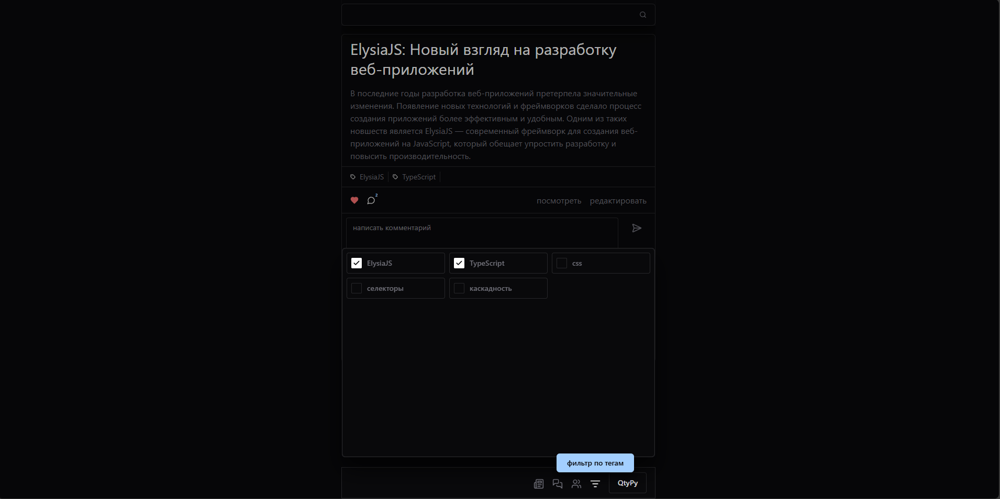
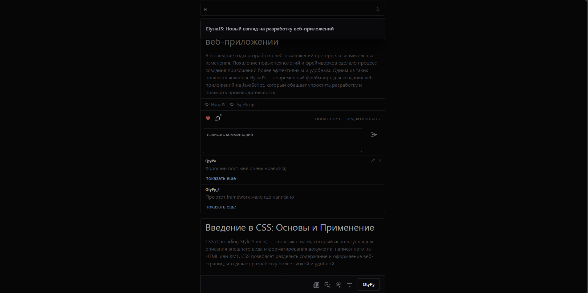
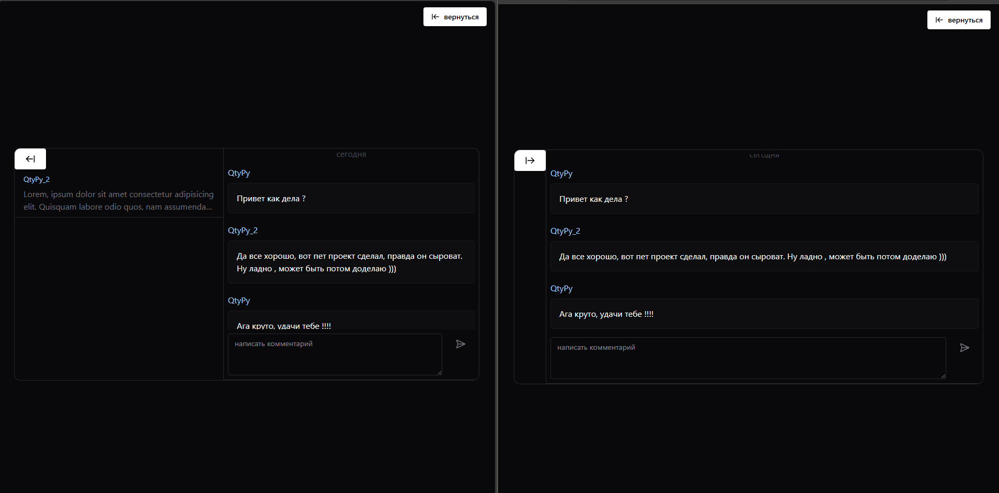
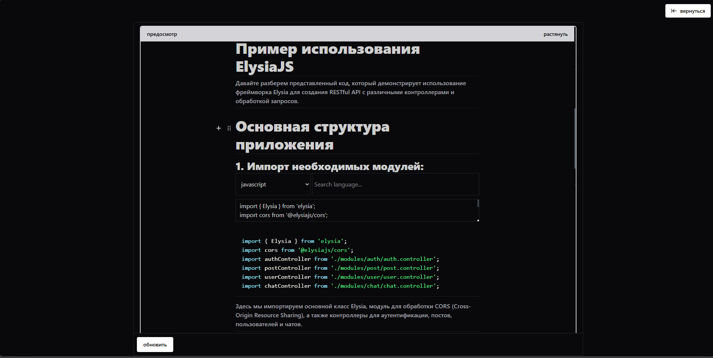
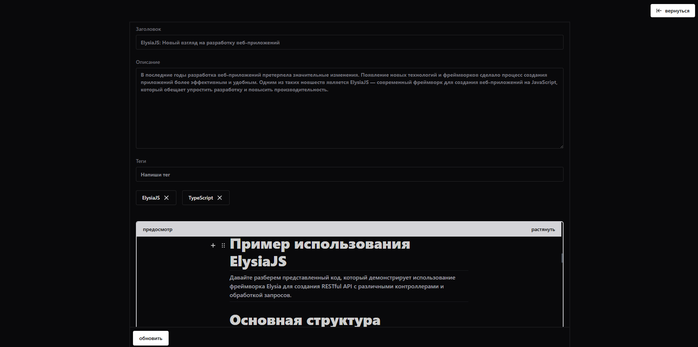
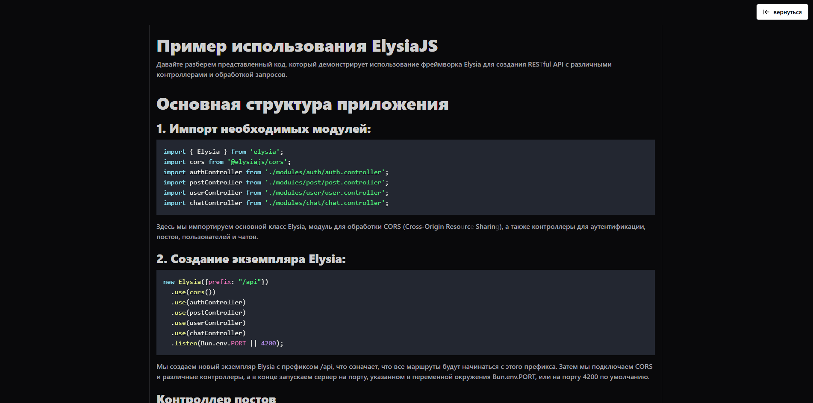

# Содержимое
- [Параметры запуска](#параметры-запуска)
- [Описание проекта: Blog](#описание-проекта-blog)
- [Серверная часть](#серверная-часть)
- [Клиентская часть](#клиентская-часть)
  - [Сервисы API](#сервисы-api)
  - [Компоненты `IsUserAuth` и `RouteGuard`](#компоненты-isuserauth-и-routeguard)
  - [Как это работает](#как-это-работает)
- [Изображения](#изображения)

# Параметры запуска
### backend работает на BunJS не на NodeJS!!!
```
> Frontend: cd frontend && npm run dev
> Backend: cd backend && npm run dev
> Prisma Studio: cd backend && npx prisma studio
```

### Описание проекта: Blog

Проект "Blog" представляет собой современное серверное и клиентское веб-приложение, разработанное с использованием фреймворка Elysia для серверной части и React для клиентской. Основная цель проекта — предоставить пользователям платформу для взаимодействия, где они могут управлять своими учетными записями, создавать и редактировать посты, а также общаться в реальном времени через чат.

#### Основные функции проекта:

1. **Серверная часть**:
   - **API для управления пользователями**: Регистрация, аутентификация (с использованием JWT), управление друзьями (подписка, отписка, подтверждение дружбы).
   - **Управление постами**: Создание, редактирование, получение и удаление постов и комментариев, а также возможность поиска постов по критериям.
   - **Чат**: Реализация обмена сообщениями в реальном времени с использованием WebSocket, управление подключениями пользователей.

2. **Клиентская часть**:
   - Разработка интерфейса с использованием **Chakra UI** для создания адаптивных и удобных компонентов.
   - **React Router** для организации маршрутизации и управления состоянием URL.
   - Использование **MobX** для управления состоянием приложения, что позволяет легко отслеживать изменения и обновлять интерфейс.
   - Реализация сервисов для работы с аутентификацией, пользователями, постами и чатом, что упрощает взаимодействие с API.

3. **Компоненты**:
   - **RouteGuard**: Защита маршрутов, проверка авторизации пользователя и управление отображением компонентов в зависимости от состояния.
   - **isUserAuth**: Проверка авторизации пользователя с возможностью автоматического перенаправления на главную страницу в случае неавторизованного доступа.

#### Технологический стек:
- **Сервер**: Elysia, JavaScript, WebSocket.
- **Клиент**: React, Chakra UI, MobX, React Router, Axios.

#### Преимущества проекта:
- Удобный и интуитивно понятный интерфейс, обеспечивающий легкость в использовании.
- Реализация функционала в реальном времени, что улучшает взаимодействие между пользователями.
- Гибкая архитектура, позволяющая легко добавлять новые функции и улучшения.

Проект "Blog" нацелен на создание активного сообщества пользователей, где они могут делиться своими мыслями, общаться и находить единомышленников.

## Серверная часть

Этот проект представляет собой серверное приложение, разработанное с использованием фреймворка Elysia. Он предоставляет API для управления пользователями, постами и чатом, включая аутентификацию и взаимодействие в реальном времени.

```javascript
// backend\src\index.ts

import { Elysia } from 'elysia';
import cors from '@elysiajs/cors';

import authController from './modules/auth/auth.controller';
import postController from './modules/post/post.controller';
import userController from './modules/user/user.controller';
import chatController from './modules/chat/chat.controller';

new Elysia({prefix: "/api"})
  .use(cors())
  .use(authController)
  .use(postController)
  .use(userController)
  .use(chatController)
  .listen(Bun.env.PORT||4200)
```
#### Аутентификация

- **Регистрация пользователей**: Позволяет новым пользователям создавать учетные записи.
- **Вход в систему**: Позволяет пользователям входить в свои учетные записи с использованием JWT (JSON Web Token).
- **Проверка токена**: Проверяет действительность токена аутентификации.

#### Управление пользователями

- **Получение списка друзей**: Позволяет пользователям получать список своих друзей.
- **Подписка и отписка**: Пользователи могут подписываться на других пользователей и отписываться от них.
- **Подтверждение дружбы**: Позволяет пользователям подтверждать запросы на дружбу.

#### Управление постами

- **Создание постов**: Пользователи могут создавать новые посты.
- **Обновление постов**: Позволяет пользователям редактировать свои посты.
- **Получение постов**: Пользователи могут получать список постов или посты по ID.
- **Поиск постов**: Позволяет пользователям искать посты по заданным критериям.
- **Удаление постов**: Пользователи могут удалять свои посты.

#### Чат

- **Получение чатов**: Позволяет пользователям получать ID чата по пользователям.
- **Обмен сообщениями в реальном времени**: Использует WebSocket для отправки, обновления и удаления сообщений в чате.
- **Управление подключениями**: Обрабатывает подключения и отключения пользователей в чате.

## Клиентская часть
```javascript
// frontend\src\app\routes.tsx

export default createBrowserRouter([
  {
    path: "/",
    element: (
      <UserProvider>
        <Layout/>
      </UserProvider>
    ),
    children: [
      {path: "/", element: <Feed/>},
      {path: "/auth", element: <PageAuth/>},
      {path: "/post/:id", element: <PagePost/>},
      {path: "/users-list", element: <IsUserAuth redirectTo='/' children={<UserList/>}/>},
      {path: "/contacts", element: <IsUserAuth redirectTo='/' children={<PageContacts/>}/>},
      {path: "/editor-post/:id?", element: <IsUserAuth redirectTo='/' children={<EditorPost/>}  />},
    ]
  }
]);

```

Клиентская часть разработана с использованием React и включает:

- **Маршрутизация**: Используется React Router для организации навигации между страницами.
- **Интерфейс**: Chakra UI для создания адаптивных компонентов и MobX для управления состоянием приложения.
- **Сервисы**: Специализированные сервисы (AuthService, ChatService, PostService, UserService) для взаимодействия с API через Axios.
- **WebSocket**: Реализована поддержка WebSocket для обмена сообщениями в реальном времени.

Клиентская часть обеспечивает надежное взаимодействие с сервером, используя как REST API, так и WebSocket для работы в реальном времени.

### Сервисы API

В клиентской части проекта "Blog" используются специализированные сервисы для взаимодействия с API. Эти сервисы обеспечивают удобный интерфейс для выполнения HTTP-запросов к серверу и управления данными, связанными с аутентификацией, пользователями, постами и чатом.

```javascript
// frontend\src\libs\api\index.ts
import AuthService from './services/api.auth';
import ChatService from './services/api.chat';
import PostService from './services/api.post';
import UserService from './services/api.user';

export default {
    AuthService,
    PostService,
    UserService,
    ChatService,
}
```

   

### Компоненты `IsUserAuth` и `RouteGuard`

#### 1. `IsUserAuth`

Компонент `IsUserAuth` предназначен для проверки, авторизован ли пользователь. Если пользователь не авторизован и задан маршрут для перенаправления, компонент автоматически перенаправляет его на главную страницу и отображает уведомление об ошибке. Это позволяет защищать определенные маршруты от неавторизованных пользователей.

**Реализация `IsUserAuth`:**

```javascript
// frontend\src\components\shared\isUserAuth.tsx

import { useUserStore } from "@/libs/store/User/STUser";
import { Show } from "@chakra-ui/react";
import { PropsWithChildren, useEffect } from "react";
import { observer } from "mobx-react-lite";
import { useNavigate } from "react-router";
import { toaster } from "@/components/ui/toaster";

export interface IProps extends PropsWithChildren {
  fallback?: any;
  when?: boolean;
  redirectTo?: string;
}

export default observer(function IsUserAuth({ fallback, when = true, children, redirectTo }: IProps) {
  const user = useUserStore();
  const navigate = useNavigate();

  // Если задан маршрут для перенаправления
  if (redirectTo) {
    useEffect(() => {
      setTimeout(() => {
        if (!user.isUserAuth) {
          navigate('/');
          toaster.create({
            title: "Вы не авторизованы",
            type: "error",
          });
        }
      }, 500);
    }, []);
  }

  return (
    <Show when={when && user.isUserAuth} fallback={fallback}>
      {children}
    </Show>
  );
});
```

#### 2. `RouteGuard`

Компонент `RouteGuard` используется для защиты маршрутов, проверяя, находится ли текущий путь в списке допустимых маршрутов. Если маршрут допустим, отображаются дочерние компоненты; если нет, они скрываются. Также предусмотрена возможность инверсии логики, что позволяет скрывать компоненты для допустимых маршрутов.

**Реализация `RouteGuard`:**

```javascript
// frontend\src\components\shared\RouteGuard.tsx

import { PropsWithChildren } from 'react';
import { useLocation } from 'react-router';

interface IProps extends PropsWithChildren {
  isValidRoutes: Array<string>;
  isInverted?: boolean;
}

export default function RouteGuard({ isValidRoutes, children, isInverted = false }: IProps) {
  const location = useLocation();
  const isValid = isValidRoutes.includes(location.pathname);

  if (isInverted) {
    return !isValid ? children : null;
  }

  return isValid ? children : null;
}
```

### Как это работает

- **`IsUserAuth`**: Этот компонент проверяет, авторизован ли пользователь, используя состояние из MobX. Если пользователь не авторизован и задан маршрут для перенаправления, он будет перенаправлен на главную страницу с уведомлением об ошибке. Если пользователь авторизован, отображаются дочерние компоненты.

- **`RouteGuard`**: Этот компонент проверяет, соответствует ли текущий маршрут списку допустимых маршрутов. Если маршрут допустим, отображаются дочерние компоненты; если нет, они скрываются. Также можно использовать инверсию логики, чтобы скрывать компоненты для допустимых маршрутов.

Эти компоненты работают вместе, чтобы обеспечить безопасность и контроль доступа в приложении, позволяя разработчикам легко управлять отображением интерфейса в зависимости от состояния авторизации пользователя и маршрутов.

# Изображения
<div>






<div/>
